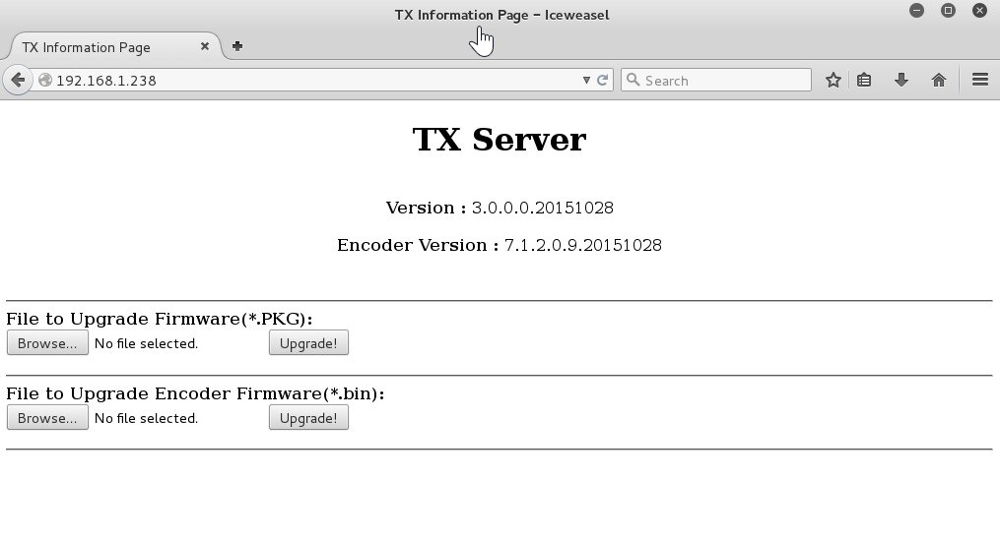
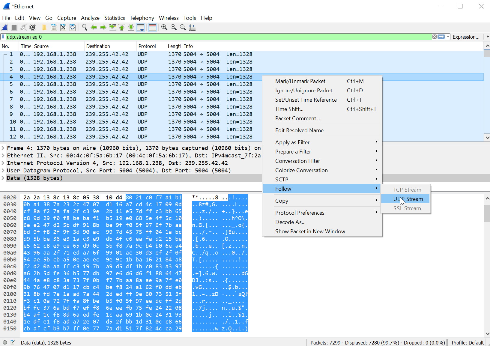
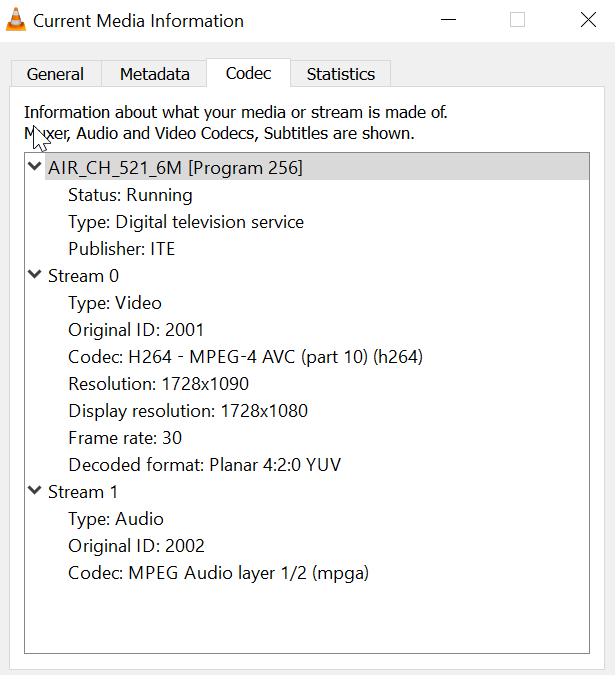

# HDBitT_hdmi_extender
My notes and tools from reverse engineering the HDbitT HDMI extender

### Todo

 - [ ] Attempt command injection using info.cgi script
 - [ ] Setup a DHCP server to respond to the receiver's DISCOVER request, then do a portscan on it
 - [ ] Do a full nmap (ports 1-65535)
 - [ ] Search for a firmware update for the transmitter

### Acquisition

I purchased this thing as a receiver/transmitter pair from [Amazon](https://www.amazon.com/gp/product/B01C9CI1B6/).  It was marketed as ` LKV373A HDMI Extender over Ethernet up to 120m / 390 ft (new ver.)`.  The box itself has no brand, model numbers, or part numbers, only a "V3.0" label.

At the time of purchase, there were no Amazon reviews, but some documentation from other reverse engineers which led me to believe this would be a fun project:
 - [TimVideos](https://github.com/timvideos/HDMI2USB/wiki/Alternatives#lenkeng-hdmi-over-ip-extender)
 - [Danman's Blog - Reverse Engineering Lenkeng HDMI over IP Extender](https://blog.danman.eu/reverse-engineering-lenkeng-hdmi-over-ip-extender/)

### First boot

When the transmitter boots, it tries to get an IP via DHCP, but falls back to 192.168.1.238.  A few gratuitous ARP requests give away the transmitter's IP address.

The second stage is to join three mutlicast groups:
 - `239.255.42.42` is used to transmit the video signal to the receivers
 - `228.67.43.91` is used to transmit a host identifier.  In my case, the host an 11-byte string: "hostIdTest"
 - `224.0.0.1` is not used, and is likely left over from example multicast code.

The third stage is to begin transmitting the video stream via UDP multicast to 239.255.42.42:5004.  Note that the packets are sent regardless of whether there is a receiver.  The packets are consistently 1370 bytes, regardless of whether the transmitter has an HDMI input signal.

Out of the box, the transmitter responds to pings and web requests on 192.168.1.238.

A packet capture spanning from the first boot of the transmitter and including about 5 seconds of video, is available [here](2016-07-15 00_16_11 - first_boot.pcapng)

### nmap scan

```
root@kali:~/hdmi# nmap -T5 192.168.1.238

Starting Nmap 6.49BETA4 ( https://nmap.org ) at 2016-07-14 21:52 CDT
Warning: 192.168.1.238 giving up on port because retransmission cap hit (2).
Nmap scan report for 192.168.1.238
Host is up (1.0s latency).
Not shown: 996 closed ports
PORT     STATE    SERVICE
80/tcp   open     http
514/tcp  filtered shell                 * (USUALLY SYSLOG) *
7000/tcp open     afs3-fileserver       * (???) *
7002/tcp open     afs3-prserver         * (???) *

Nmap done: 1 IP address (1 host up) scanned in 5.32 seconds
```

### HTTP Server

The box has a kludgey web server which allows for upgrading the "firmware" and "encoder firmware".  The HTTP header does not include any identifying information, so they may have rolled their own server.

The purpose of the web server appears to primarly be to allow the customer to upgrade the firmware, although there is more functionality in the code that wasn't visible on the front page.  My transmitter arrived with the following firmware versions:

```
Version : 3.0.0.0.20151028
Encoder Version : 7.1.2.0.9.20151028
```



The upgrades appear to be packaged with pre-specified file extensions.  Firmware is a .PKG file; Encoder firmware is a .BIN file.

Looking through the source of the page, there is a CGI script at `/dev/info.cgi` which does all the heavy lifting.  It is controlled through a GET variable (`action`) which, at a minimum, supports `macaddr`, `upgrade`, `reboot`, `Reset`, `network`, `softap`, and `wifi`:

- `macaddr` allows the end user to change the MAC address of the device.  Validation takes place client-side, and there is likely a command injection here if the device is using `ifconfig`
- `reset` reverts the device to factory defaults.  A time GET parameter (`t`) is given, and a command injection may be possible, provided that `time` is fed to a sleep command.
- `reboot` presumably calls reboot, and also includes a time GET parameter (`t`) which may provide a command injection.  The reboot would try to occur first, which would cause issues with the command injection.
- `network` takes two GET parameters: `ipaddr0` and `netmask0`, which are validated client-side.  There is likely command injection here, assuming use of `ifconfig` as in `macaddr` above.
- `upgrade` uses an IFRAME (`iframeupload`).  (*TODO*: Look into the upgrade function.  Find a firmware package to inspect.)
- `softap` and `wifi` suggest that there is another device which has WiFi functionality to connect to a Wifi network or serve as an ad-hoc node.

### Extracting video

As a proof of concept, I extracted the UDP datastream with Wireshark and assembled a crappy MP4 stream.  There's some corruption, but it's definitely there.  I'm guessing there is some proprietary header information somewhere in the stream that I'll need to find and clean up.  Here was my method:

1) Use Wireshark to capture the data.  I plugged an Ethernet NIC into a switch that intercepted the traffic between the transmitter and receiver.  Since I used a smart switch, I had to disable it's multicast filtering so I received all of the data.

2) After capturing about five seconds of data, I stopped the capture.

3) I cleaned the capture by filtering on one of the UDP packets:



4) I exported the raw data (by choosing Show data as: "raw") then saving the result to a file.

5) Since I was in the middle of the stream, I used a bash one-liner and `dd` to strip off the bytes of the stream, one at a time, until I arrived at the start of a recognizable MP4 stream.  This turned out to be completely unnecessary, as VLC and mPlayer were happy to deal with a corrupted stream:

`for i in {1..2000}; do dd if=live-stream.bin of=live-stream.bin.$i bs=1 skip=$i; done`

mPlayer played the stream with some artifacts, and identified the video stream as: `Video: MPEG4 Video (H264) 1728x1080 30fps [V: h264 constrained baseline L4.0, yuv420p, 1728x1080]`

VLC had considerably more difficulty, but recognized the length of the file and the first few rows of pixels.  VLC provided more info about the strea:m 



As an aside, the video stream contains the strings `Private Network` and `AIR_CH_521_6M`.

The packet capture also contains GVSP (GigE Vision Streaming Protocol) packets every two seconds on UDP/6000.  The Wireshark dissector for GVSP is incomplete (or this is a non-standard implementation).  Unfortunately, the documentation I've found so far is very non-technical.

### Command Injection

#### `reboot`
The easiest method would be to use the `t` values in the `reset` and `reboot` parameters to `info.cgi`.  Unfortunately, despite the suggestions of the Javascript in the UI, this functionality doesn't appear to be implemented.  The values I've supplied for `t` are just being ignored, and the reboot is occuring immediately regardless of `t=0`, `t=10`, ... `t=10000`.

#### `reset`
This appears to be completely unimplemented.  There is no indication that the device is responding to the `reset` request.  The HTTP connection is immediately closed.

#### `network`
This action behaves strangely, and it might be because I've been prone to typos while experimenting with it:

```GET /dev/info.cgi?action=network&dhcp=on&ipaddr0=192&ipaddr1=168&ipaddr2=1&ipaddr3=2&netmask0=255&netmask1=255&netmask2=255&netmask3=0&gw0=192&gw1=168&gw2=1&gw3=254 HTTP/1.1```
