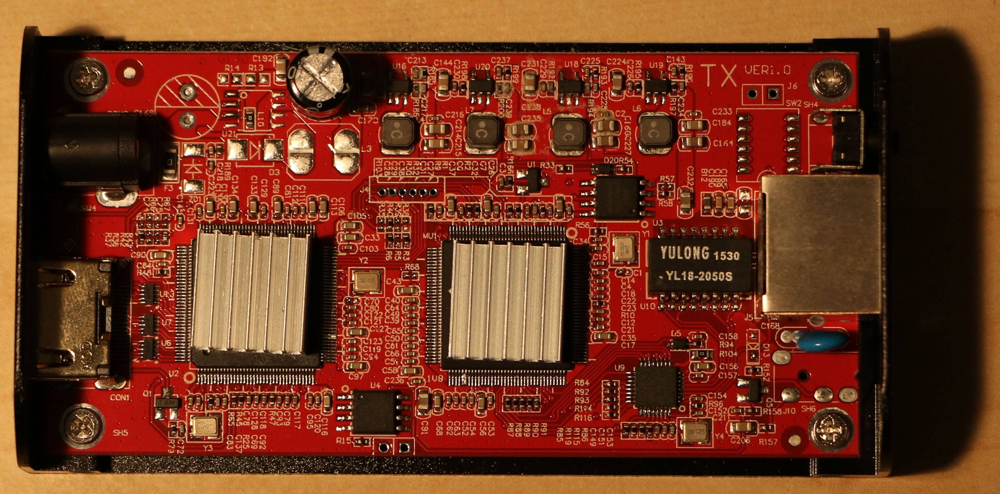
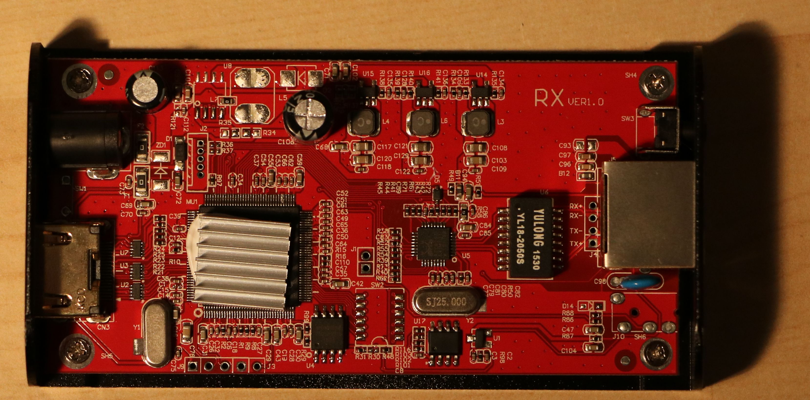

# HDBitT_hdmi_extender

My notes from reverse engineering the HDbitT HDMI extender.  Be warned: this is a stream-of-conciousness braindump with a lot of raw data.

### Todo

 - [x] Attempt command injection using info.cgi script
 - [ ] Setup a DHCP server to respond to the receiver's DISCOVER request, then do a portscan on it
 - [ ] Do a full nmap (ports 1-65535)
 - [x] Search for a firmware update for the transmitter
 - [ ] Connect to serial port, try sending every character to interrupt boot
 - [ ] Is the RX line to the processor connected?

### Acquisition

I purchased this thing as a receiver/transmitter pair from [Amazon](https://www.amazon.com/gp/product/B01C9CI1B6/).  It was marketed as ` LKV373A HDMI Extender over Ethernet up to 120m / 390 ft (new ver.)`.  The box itself has no brand, model numbers, or part numbers, only a "V3.0" label.

At the time of purchase, there were no Amazon reviews, but some documentation from other reverse engineers which led me to believe this would be a fun project:
 - [TimVideos](https://github.com/timvideos/HDMI2USB/wiki/Alternatives#lenkeng-hdmi-over-ip-extender)
 - [Danman's Blog - Reverse Engineering Lenkeng HDMI over IP Extender](https://blog.danman.eu/reverse-engineering-lenkeng-hdmi-over-ip-extender/)

### First boot

When the transmitter boots, it tries to get an IP via DHCP, but falls back to 192.168.1.238.  A few gratuitous ARP requests give away the transmitter's IP address.

The second stage is to join three mutlicast groups:
 - `239.255.42.42` is used to transmit the video signal to the receivers
 - `228.67.43.91` is used to transmit a host identifier.  In my case, the host an 11-byte string: "hostIdTest"
 - `224.0.0.1` is not used, and is likely left over from example multicast code.

The third stage is to begin transmitting the video stream via UDP multicast to 239.255.42.42:5004.  Note that the packets are sent regardless of whether there is a receiver.  The packets are consistently 1370 bytes, regardless of whether the transmitter has an HDMI input signal.

Out of the box, the transmitter responds to pings and web requests on 192.168.1.238.

A packet capture spanning from the first boot of the transmitter and including about 5 seconds of video, is available [here](2016-07-15 00_16_11 - first_boot.pcapng)

### nmap scan

```
root@kali:~/hdmi# nmap -T5 192.168.1.238

Starting Nmap 6.49BETA4 ( https://nmap.org ) at 2016-07-14 21:52 CDT
Warning: 192.168.1.238 giving up on port because retransmission cap hit (2).
Nmap scan report for 192.168.1.238
Host is up (1.0s latency).
Not shown: 996 closed ports
PORT     STATE    SERVICE
80/tcp   open     http
514/tcp  filtered shell                 * (USUALLY SYSLOG) *
7000/tcp open     afs3-fileserver       * (???) *
7002/tcp open     afs3-prserver         * (???) *

Nmap done: 1 IP address (1 host up) scanned in 5.32 seconds
```

### HTTP Server

The box has a kludgey web server which allows for upgrading the "firmware" and "encoder firmware".  The HTTP header does not include any identifying information, so they may have rolled their own server.

The purpose of the web server appears to primarly be to allow the customer to upgrade the firmware, although there is more functionality in the code that wasn't visible on the front page.  My transmitter arrived with the following firmware versions:

```
Version : 3.0.0.0.20151028
Encoder Version : 7.1.2.0.9.20151028
```


The upgrades appear to be packaged with pre-specified file extensions.  Firmware is a .PKG file; Encoder firmware is a .BIN file.

Looking through the source of the page, there is a CGI script at `/dev/info.cgi` which does all the heavy lifting.  It is controlled through a GET variable (`action`) which, at a minimum, supports `macaddr`, `upgrade`, `reboot`, `Reset`, `network`, `softap`, and `wifi`:

- `macaddr` allows the end user to change the MAC address of the device.  Validation takes place client-side, and there is likely a command injection here if the device is using `ifconfig`
- `reset` reverts the device to factory defaults.  A time GET parameter (`t`) is given, and a command injection may be possible, provided that `time` is fed to a sleep command.
- `reboot` presumably calls reboot, and also includes a time GET parameter (`t`) which may provide a command injection.  The reboot would try to occur first, which would cause issues with the command injection.
- `network` takes two GET parameters: `ipaddr0` and `netmask0`, which are validated client-side.  There is likely command injection here, assuming use of `ifconfig` as in `macaddr` above.
- `upgrade` uses an IFRAME (`iframeupload`).  (*TODO*: Look into the upgrade function.  Find a firmware package to inspect.)
- `softap` and `wifi` suggest that there is another device which has WiFi functionality to connect to a Wifi network or serve as an ad-hoc node.

### Extracting video

As a proof of concept, I extracted the UDP datastream with Wireshark and assembled a crappy MP4 stream.  There's some corruption, but it's definitely there.  I'm guessing there is some proprietary header information somewhere in the stream that I'll need to find and clean up.  Here was my method:

1) Use Wireshark to capture the data.  I plugged an Ethernet NIC into a switch that intercepted the traffic between the transmitter and receiver.  Since I used a smart switch, I had to disable it's multicast filtering so I received all of the data.

2) After capturing about five seconds of data, I stopped the capture.

3) I cleaned the capture by filtering on one of the UDP packets:


4) I exported the raw data (by choosing Show data as: "raw") then saving the result to a file.

5) Since I was in the middle of the stream, I used a bash one-liner and `dd` to strip off the bytes of the stream, one at a time, until I arrived at the start of a recognizable MP4 stream.  This turned out to be completely unnecessary, as VLC and mPlayer were happy to deal with a corrupted stream:

`for i in {1..2000}; do dd if=live-stream.bin of=live-stream.bin.$i bs=1 skip=$i; done`

mPlayer played the stream with some artifacts, and identified the video stream as: `Video: MPEG4 Video (H264) 1728x1080 30fps [V: h264 constrained baseline L4.0, yuv420p, 1728x1080]`

VLC had considerably more difficulty, but recognized the length of the file and the first few rows of pixels.  VLC provided more info about the strea:m 


As an aside, the video stream contains the strings `Private Network` and `AIR_CH_521_6M`.

The packet capture also contains GVSP (GigE Vision Streaming Protocol) packets every two seconds on UDP/6000.  The Wireshark dissector for GVSP is incomplete (or this is a non-standard implementation).  Unfortunately, the documentation I've found so far is very non-technical.

### Command Injection

#### `reboot`
The easiest method would be to use the `t` values in the `reset` and `reboot` parameters to `info.cgi`.  Unfortunately, despite the suggestions of the Javascript in the UI, this functionality doesn't appear to be implemented.  The values I've supplied for `t` are just being ignored, and the reboot is occuring immediately regardless of `t=0`, `t=10`, ... `t=10000`.

Trying to sneak in semicolons and pipes proved unfruitful, including using URI encoding.  The web server is definitely parsing URI encoding as part of a string in the `action` parameter, though.

#### `reset`
This appears to be completely unimplemented.  There is no indication that the device is responding to the `reset` request.  The HTTP connection is immediately closed.

#### `network`
This action behaves strangely, and it might be because I've been prone to typos while experimenting with it:

```GET /dev/info.cgi?action=network&dhcp=on&ipaddr0=192&ipaddr1=168&ipaddr2=1&ipaddr3=2&netmask0=255&netmask1=255&netmask2=255&netmask3=0&gw0=192&gw1=168&gw2=1&gw3=254 HTTP/1.1```

### Hardware Disassembly

I'll take off the heatsinks when I've got some extra thermal paste, but here's the innards of the transmitter:



And the receiver:



### Firmware Analysis

Still following in the footsteps of danman, I've started to analyze some of the firmwares he acquired from a vendor.  He's hosted them on his Google Drive, and I've copied them locally here.  Binwalk is able to find the web server files without issue, but it also uncovers LZMA-compressed data in many places, none of which is uncompressing nicely:

```
root@kali:~/hdmi/FIRMWARE# binwalk -e LKV373A_RX_20151105_PKG.PKG

DECIMAL       HEXADECIMAL     DESCRIPTION
--------------------------------------------------------------------------------
2816192       0x2AF8C0        HTML document header
2818060       0x2B000C        HTML document footer
2875328       0x2BDFC0        LZMA compressed data, properties: 0x5D, dictionary size: 131072 bytes, missing uncompressed size
2876978       0x2BE632        LZMA compressed data, properties: 0x5D, dictionary size: 65536 bytes, missing uncompressed size
3008178       0x2DE6B2        XML document, version: "1.0"
3008218       0x2DE6DA        HTML document header
3016267       0x2E064B        HTML document footer
3036203       0x2E542B        HTML document header
3125737       0x2FB1E9        XML document, version: "1.0"
3125777       0x2FB211        HTML document header
3127078       0x2FB726        HTML document footer

root@kali:~/hdmi/FIRMWARE/_LKV373A_RX_20151105_PKG.PKG.extracted# 7z e 2BDFC0.7z 

7-Zip [64] 9.20  Copyright (c) 1999-2010 Igor Pavlov  2010-11-18
p7zip Version 9.20 (locale=en_US.UTF-8,Utf16=on,HugeFiles=on,1 CPU)

Processing archive: 2BDFC0.7z

file 2BDFC0
already exists. Overwrite with 
2BDFC0?
(Y)es / (N)o / (A)lways / (S)kip all / A(u)to rename all / (Q)uit? y
Extracting  2BDFC0     Data Error

Sub items Errors: 1
```

Binwalk is labeling the files as 7zip files, which is why I've tried 7z decompression, but many file formats use LZMA compression, so it's unclear whether binwalk is accurate in labelling these as 7zip files.

I've also tried stripping bytes from the end of each file when I realized that there is binary data at the beginning of the file, but uncompressed strings at the end of the file:

```
root@kali:~/hdmi/FIRMWARE/_LKV373A_RX_V3.0_20151130_PKG.PKG.extracted# strings 2BDFCE.7z | tail
[tcpip]
dhcp=y
autoip=n
ipaddr=192.168.1.1
netmask=255.255.255.0
gw=192.168.1.254
[multicast]
group=0
baud=115200
/tmp
```

The strings are all the static web server content and boring config files.  So, let's try stripping away the file, byte by byte, until 7zip is able to successfully test the file without reporting a "Data Error".

```
for i in {15440..1}; do dd if=2BDFCE.7z of=2BDFCE.$i.7z bs=1 count=$i; done
for i in `ls 2BDFCE.*.7z`; do 7z t $i | grep Testing | grep -v Error; done
```

Zip.  Zero.  Bupkis.

Let's try using lzma instead of 7z.  We'll need to redirect STDERR to STDOUT, then exclude the string "Compressed Data is Corrupt"

```
for i in `ls 2BDFCE.*.7z`; do lzma -t $i 2>&1 | grep -v "Compressed data is corrupt"; done
```

I've started looking through the files for footers, which would either confirm a file format, or tell me if/how multiple file formats are concatenated.  A few sites suggest magic bytes in the footers of LZMA-compressed file formats:
 - 'YZ' ends a .xz file, according to [the LZMA Utils author at tukaanu.org](tukaani.org/xz/xz-file-format.txt)
 - '0x0A I P 0x0A' ends a .7z file, according to [the same LZMA Utils author, but on the 7zip forums on sourceforce.net](https://sourceforge.net/p/sevenzip/discussion/45797/thread/37cfd783/)

No 7zip footers were found looking the directory of danman's firmware packages:

```
root@kali:~/hdmi/FIRMWARE# binwalk -e * | egrep "Target|LZMA"
Target File:   LKV373A_RX_V3.0_20151130_PKG.PKG
2875342       0x2BDFCE        LZMA compressed data, properties: 0x5D, dictionary size: 131072 bytes, missing uncompressed size
2876992       0x2BE640        LZMA compressed data, properties: 0x5D, dictionary size: 65536 bytes, missing uncompressed size
Target File:   LKV373A_RX_V3.0b_20160218.PKG
2624330       0x280B4A        LZMA compressed data, properties: 0x5D, dictionary size: 131072 bytes, missing uncompressed size
2625980       0x2811BC        LZMA compressed data, properties: 0x5D, dictionary size: 65536 bytes, missing uncompressed size
Target File:   LKV373A_TX_20151028_bin.bin
1317          0x525           LZMA compressed data, properties: 0x8A, dictionary size: 16777216 bytes, uncompressed size: 1439474 bytes
2085          0x825           LZMA compressed data, properties: 0x8A, dictionary size: 16777216 bytes, uncompressed size: 1390322 bytes
3109          0xC25           LZMA compressed data, properties: 0x8A, dictionary size: 16777216 bytes, uncompressed size: 1390321 bytes
834185        0xCBA89         LZMA compressed data, properties: 0x65, dictionary size: 1048576 bytes, uncompressed size: 1389568 bytes
Target File:   LKV373A_TX_20151028_PKG.PKG
Target File:   LKV373A_TX_V3.0_20151130_bin.bin
1317          0x525           LZMA compressed data, properties: 0x8A, dictionary size: 16777216 bytes, uncompressed size: 1439474 bytes
2085          0x825           LZMA compressed data, properties: 0x8A, dictionary size: 16777216 bytes, uncompressed size: 1390322 bytes
3109          0xC25           LZMA compressed data, properties: 0x8A, dictionary size: 16777216 bytes, uncompressed size: 1390321 bytes
834185        0xCBA89         LZMA compressed data, properties: 0x65, dictionary size: 1048576 bytes, uncompressed size: 1389568 bytes
Target File:   LKV373A_TX_V3.0_20151130_PKG.PKG
Target File:   LKV373A_TX_V3.0b_20160218(1).PKG
Target File:   LKV373A_TX_V3.0b_20160218.bin
1317          0x525           LZMA compressed data, properties: 0x8A, dictionary size: 16777216 bytes, uncompressed size: 1439474 bytes
2085          0x825           LZMA compressed data, properties: 0x8A, dictionary size: 16777216 bytes, uncompressed size: 1390322 bytes
3109          0xC25           LZMA compressed data, properties: 0x8A, dictionary size: 16777216 bytes, uncompressed size: 1390321 bytes
834185        0xCBA89         LZMA compressed data, properties: 0x65, dictionary size: 1048576 bytes, uncompressed size: 1389568 bytes
Target File:   LKV373A_TX_V3.0b_20160218.PKG
Target File:   LKV373A_V3.0b_网页升级操作说明.pdf
Target File:   LKV373A_V3.0_FW.rar
Target File:   LKV373A_V3.0_网页升级操作说明.pdf
```

```
for i in `find . -iname *.7z`; do echo $i; xxd $i | grep "0a49 50d2"; done
```

However, I did find some "YZ" footers, which might indicate an .xz file.  Here's a minimized list:

```
./_LKV373A_TX_V3.0_20151130_bin.bin.extracted/525.7z
  0251410: 43f7 073a 595a 132f e0df 7b33 dbb3 177a  C..:YZ./..{3...z

./_LKV373A_TX_20151028_bin.bin.extracted/525.7z
  0204940: c604 16cf 12ec 595a 8f42 8377 8012 efc6  ......YZ.B.w....
  020ae40: 595a 8f43 0614 67c2 8e17 cfb2 d806 5586  YZ.C..g.......U.
  022de60: a02c 1e5b e307 26d0 bc3e 9813 077a 595a  .,.[..&..>...zYZ

./_LKV373A_TX_V3.0b_20160218.bin.extracted/525.7z
  0213060: 83cf 9759 5afe 40ab e719 9b97 ecae 40fe  ...YZ.@.......@.
  02191d0: 2610 5846 595a 664a 3d1e 00c1 5700 9c7e  &.XFYZfJ=...W..~
  0258a10: a170 f759 5a07 460e 4b08 470d d857 f18a  .p.YZ.F.K.G..W..

./_LKV373A_TX_V3.0b_20160218.bin.extracted/CBA89.7z
  014dc70: 595a 664a 3d1e 00c1 5700 9c7e 3c7e 0465  YZfJ=...W..~<~.e

./_LKV373A_RX_V3.0b_20160218.PKG.extracted/280B4A.7z
  002ede0: aeff 1697 eb59 5aca c212 969d 1a3e f82d  .....YZ......>.-
  004ec90: 4435 8aa8 2dc7 be59 5ab7 ddf0 02fe 140d  D5..-..YZ.......

./_LKV373A_RX_V3.0b_20160218.PKG.extracted/2811BC.7z
  002e770: 1697 eb59 5aca c212 969d 1a3e f82d 3403  ...YZ......>.-4.
  004e620: 8aa8 2dc7 be59 5ab7 ddf0 02fe 140d 8e7d  ..-..YZ........}
```
